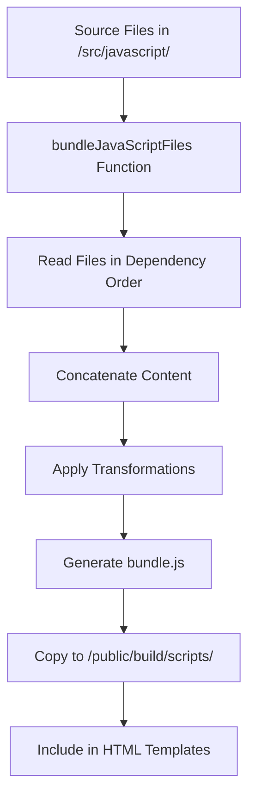

# JavaScript Bundling and Modular Architecture

This document explains how JavaScript files are organized, bundled, and deployed in the CMS Website Builder for optimal performance and maintainability.

## 📖 Overview

The CMS Website Builder uses a sophisticated JavaScript bundling system that combines modular development with optimized deployment. Instead of loading multiple separate JavaScript files (which would require multiple HTTP requests), the system bundles all JavaScript files into a single optimized file (`bundle.js`).

## 🚀 Key Benefits

### Performance Advantages
1. **Reduced HTTP Requests**: Only one script file is loaded instead of 10+ separate files
2. **Faster Page Load**: Fewer network requests result in significantly faster page load times
3. **Better Caching**: Single bundle file can be efficiently cached by browsers
4. **Minimized Latency**: Eliminates the cascade of request dependencies

### Development Benefits
1. **Modular Organization**: Code remains organized in separate files during development
2. **Dependency Management**: Clear dependency relationships between modules
3. **Hot Reloading**: Development server can efficiently rebuild only changed modules
4. **Easy Debugging**: Source maps maintain connection to original files

### Production Benefits
1. **Code Optimization**: Minification and compression reduce file size
2. **Tree Shaking**: Unused code is automatically removed
3. **Compatibility**: ES5 output ensures broad browser compatibility
4. **Error Handling**: Centralized error reporting and monitoring

## 🏗️ Architecture and Process

### Bundling Workflow



### When Bundling Occurs

The bundling process is triggered during:

1. **Page Publishing**: When you click "Publish" in the editor
2. **Build Process**: During development and production builds
3. **Preview Generation**: When starting the live preview server
4. **API Calls**: Via the `/api/publish/create-dirs` endpoint

### Bundle Generation Process

```javascript
// Simplified bundling process
export const bundleJavaScriptFiles = async () => {
  const files = [
    'utils.js',           // Base utilities (must be first)
    'config.js',          // Configuration settings
    'api.js',             // API communication layer
    'localStorage.js',    // Local storage management
    'reducer.js',         // State management
    'gtmAction.js',       // Analytics integration
    'init.js',            // Initialization functions
    'user.js',            // User management
    'searchResult.js',    // Search functionality
    'serviceDetails.js',  // Service-specific logic
    'bookingCalculation.js', // Business logic
    'mainApplication.js'  // Main entry point (must be last)
  ];
  
  let bundledContent = '';
  
  for (const file of files) {
    const content = await fs.readFile(`src/javascript/${file}`, 'utf8');
    bundledContent += `\n/* === ${file} === */\n${content}\n`;
  }
  
  // Apply optimizations and write bundle
  await fs.writeFile('public/build/scripts/bundle.js', bundledContent);
};
```

## 📁 File Organization and Dependencies

JavaScript files are strategically organized in the `/src/javascript/` directory with clear dependency relationships:

```
src/javascript/
├── utils.js              # ⚡ Core utilities (loaded first)
│   ├── DOM manipulation helpers
│   ├── String/number formatting
│   ├── Validation functions
│   └── Common utility methods
│
├── config.js             # ⚙️ Configuration management
│   ├── API endpoints
│   ├── Feature flags
│   ├── Environment settings
│   └── Application constants
│
├── api.js                # 🌐 API communication layer
│   ├── HTTP request handlers
│   ├── Response processing
│   ├── Error handling
│   └── Endpoint management
│
├── localStorage.js       # 💾 Local storage utilities
│   ├── Data persistence
│   ├── Cache management
│   ├── User preferences
│   └── Session handling
│
├── reducer.js            # 🔄 State management
│   ├── Application state
│   ├── Data transformation
│   ├── State updates
│   └── Event dispatching
│
├── gtmAction.js          # 📊 Analytics integration
│   ├── Google Tag Manager
│   ├── Event tracking
│   ├── Conversion tracking
│   └── Custom dimensions
│
├── init.js               # 🚀 Initialization functions
│   ├── DOM ready handlers
│   ├── Component initialization
│   ├── Event listeners setup
│   └── Application bootstrap
│
├── user.js               # 👤 User management
│   ├── Authentication
│   ├── User profiles
│   ├── Permissions
│   └── Session management
│
├── searchResult.js       # 🔍 Search functionality
│   ├── Search algorithms
│   ├── Filter management
│   ├── Results display
│   └── Search history
│
├── serviceDetails.js     # 🛠️ Service-specific logic
│   ├── Business rules
│   ├── Service calculations
│   ├── Validation rules
│   └── Domain logic
│
├── bookingCalculation.js # 💰 Business calculations
│   ├── Pricing logic
│   ├── Discount calculations
│   ├── Tax computations
│   └── Payment processing
│
└── mainApplication.js    # 🎯 Main entry point (loaded last)
    ├── Application orchestration
    ├── Component coordination
    ├── Final initialization
    └── Error boundary setup
```

### Dependency Chain

The files are loaded in a specific order to ensure dependencies are available:

1. **utils.js** → Provides foundational functions used by all other modules
2. **config.js** → Defines constants and settings used throughout the app
3. **api.js** → Depends on utils and config for HTTP communication
4. **localStorage.js** → Uses utils for data validation and serialization
5. **reducer.js** → Manages application state, uses utils and config
6. **gtmAction.js** → Analytics tracking, depends on config
7. **init.js** → Initialization logic, uses utils and config
8. **user.js** → User management, depends on api and localStorage
9. **searchResult.js** → Search features, uses api and utils
10. **serviceDetails.js** → Business logic, depends on multiple modules
11. **bookingCalculation.js** → Complex calculations, uses utils and config
12. **mainApplication.js** → Orchestrates everything, depends on all modules

## 🔗 Code Sharing and Global Namespace

Since the published sites use ES5 and don't employ modern module systems (CommonJS/ES Modules), code sharing is accomplished through a global namespace pattern:

### Namespace Pattern

Each file creates a namespace object on the global `window` object:

```javascript
/**
 * Example: utils.js
 * Core utility functions for the application
 */

// Create namespace object
var Utils = {
  // DOM manipulation
  getElementById: function(id) {
    return document.getElementById(id);
  },
  
  // String formatting
  formatCurrency: function(amount, currency = 'USD') {
    return new Intl.NumberFormat('en-US', {
      style: 'currency',
      currency: currency
    }).format(amount);
  },
  
  // Date formatting
  formatDate: function(date, format = 'MM/DD/YYYY') {
    const d = new Date(date);
    const month = String(d.getMonth() + 1).padStart(2, '0');
    const day = String(d.getDate()).padStart(2, '0');
    const year = d.getFullYear();
    
    return format
      .replace('MM', month)
      .replace('DD', day)
      .replace('YYYY', year);
  },
  
  // Validation helpers
  isValidEmail: function(email) {
    const emailRegex = /^[^\s@]+@[^\s@]+\.[^\s@]+$/;
    return emailRegex.test(email);
  },
  
  // Debounce function
  debounce: function(func, wait) {
    var timeout;
    return function executedFunction() {
      var context = this;
      var args = arguments;
      var later = function() {
        timeout = null;
        func.apply(context, args);
      };
      clearTimeout(timeout);
      timeout = setTimeout(later, wait);
    };
  }
};

// Make globally available
window.Utils = Utils;
```

### Cross-Module Communication

```javascript
/**
 * Example: api.js
 * API communication layer
 */

var APIManager = {
  baseURL: window.Config ? window.Config.API_BASE_URL : '',
  
  // Generic request handler
  request: function(endpoint, options = {}) {
    const url = this.baseURL + endpoint;
    const defaultOptions = {
      method: 'GET',
      headers: {
        'Content-Type': 'application/json',
      }
    };
    
    const requestOptions = Object.assign(defaultOptions, options);
    
    return fetch(url, requestOptions)
      .then(response => {
        if (!response.ok) {
          throw new Error('Network response was not ok');
        }
        return response.json();
      })
      .catch(error => {
        if (window.Utils) {
          window.Utils.logError('API Request Failed', error);
        }
        throw error;
      });
  },
  
  // Specific API methods
  getPageData: function(pageId) {
    return this.request(`/api/page/${pageId}`);
  },
  
  savePageData: function(pageId, data) {
    return this.request(`/api/page/${pageId}`, {
      method: 'POST',
      body: JSON.stringify(data)
    });
  }
};

window.APIManager = APIManager;
```

### Safe Dependency Checking

Always check for dependencies before using them:

```javascript
/**
 * Example: mainApplication.js
 * Main application entry point
 */

var MainApplication = {
  init: function() {
    // Check for required dependencies
    if (!window.Utils) {
      console.error('Utils module not loaded');
      return;
    }
    
    if (!window.Config) {
      console.error('Config module not loaded');
      return;
    }
    
    // Initialize application
    this.setupEventListeners();
    this.loadInitialData();
    this.initializeComponents();
  },
  
  setupEventListeners: function() {
    // Use debounced scroll handler
    if (window.Utils && window.Utils.debounce) {
      var debouncedScrollHandler = window.Utils.debounce(
        this.handleScroll.bind(this), 
        100
      );
      window.addEventListener('scroll', debouncedScrollHandler);
    }
  },
  
  loadInitialData: function() {
    if (window.APIManager) {
      window.APIManager.getPageData('home')
        .then(data => {
          this.renderPage(data);
        })
        .catch(error => {
          console.error('Failed to load page data:', error);
        });
    }
  },
  
  handleScroll: function() {
    // Scroll handling logic
    if (window.GTMAction) {
      window.GTMAction.trackEvent('User', 'Scroll', 'Page Scroll');
    }
  }
};

// Initialize when DOM is ready
document.addEventListener('DOMContentLoaded', function() {
  MainApplication.init();
});

window.MainApplication = MainApplication;
```

## 🛠️ Development Workflow

### Adding a New JavaScript Module

1. **Create the file** in `/src/javascript/` following the naming convention
2. **Add to the bundle configuration** in the correct dependency order
3. **Export functionality** through a global namespace
4. **Document dependencies** and public API

```javascript
// Example: adding a new notifications.js module

/**
 * Notifications Module
 * Handles user notifications and alerts
 */

var NotificationManager = {
  // Configuration
  config: {
    duration: 5000,
    position: 'top-right',
    maxNotifications: 5
  },
  
  // Internal state
  notifications: [],
  container: null,
  
  // Initialize the notification system
  init: function() {
    this.createContainer();
    this.setupStyles();
  },
  
  // Show a notification
  show: function(message, type = 'info', options = {}) {
    if (!window.Utils) {
      console.error('Utils module required for notifications');
      return;
    }
    
    const notification = {
      id: Date.now(),
      message: message,
      type: type,
      timestamp: new Date(),
      ...options
    };
    
    this.addNotification(notification);
    
    // Track with analytics if available
    if (window.GTMAction) {
      window.GTMAction.trackEvent('Notification', 'Show', type);
    }
  },
  
  // Create notification container
  createContainer: function() {
    if (!this.container) {
      this.container = document.createElement('div');
      this.container.className = 'notification-container';
      document.body.appendChild(this.container);
    }
  }
};

// Make globally available
window.NotificationManager = NotificationManager;
```

2. **Update bundling configuration** in `publish-utils.js`:

```javascript
const files = [
  'utils.js',
  'config.js',
  'api.js',
  'localStorage.js',
  'notifications.js',  // Add new module in appropriate position
  'reducer.js',
  // ... rest of files
];
```

### Testing and Debugging

#### Development Testing
```javascript
// Test individual modules in browser console
if (window.Utils) {
  console.log('Utils loaded:', Object.keys(window.Utils));
  console.log('Date format test:', window.Utils.formatDate(new Date()));
}

// Test module dependencies
console.log('Available modules:', Object.keys(window).filter(key => 
  typeof window[key] === 'object' && 
  window[key] !== null && 
  key !== 'window'
));
```

#### Production Debugging
```javascript
// Add debug mode to your modules
var DebugMode = {
  enabled: false,
  
  log: function(module, message, data) {
    if (this.enabled) {
      console.log(`[${module}] ${message}`, data);
    }
  },
  
  enable: function() {
    this.enabled = true;
    console.log('Debug mode enabled');
  },
  
  disable: function() {
    this.enabled = false;
  }
};

window.DebugMode = DebugMode;
```

### Performance Optimization

#### Bundle Size Optimization
- Remove unused functions and modules
- Minify code in production builds
- Use tree shaking for dead code elimination
- Implement lazy loading for non-critical modules

#### Runtime Optimization
```javascript
// Use efficient DOM manipulation
var DOMOptimizer = {
  // Batch DOM updates
  batchUpdate: function(updates) {
    const fragment = document.createDocumentFragment();
    updates.forEach(update => fragment.appendChild(update));
    return fragment;
  },
  
  // Efficient event delegation
  delegate: function(parent, selector, event, handler) {
    parent.addEventListener(event, function(e) {
      const target = e.target.closest(selector);
      if (target) {
        handler.call(target, e);
      }
    });
  }
};
```

## 🚀 Advanced Features

### Environment-Specific Builds

The bundling system supports different configurations for development and production:

```javascript
// config.js - Environment-specific settings
var Config = {
  // Determine environment
  isDevelopment: window.location.hostname === 'localhost',
  isProduction: window.location.hostname !== 'localhost',
  
  // API configuration
  API_BASE_URL: window.location.hostname === 'localhost' 
    ? 'http://localhost:3002/api'
    : 'https://your-production-domain.com/api',
  
  // Feature flags
  features: {
    debugMode: window.location.hostname === 'localhost',
    analytics: true,
    experiments: false
  },
  
  // Performance settings
  performance: {
    debounceDelay: 100,
    throttleDelay: 16,
    cacheTimeout: 300000 // 5 minutes
  }
};

window.Config = Config;
```

### Error Handling and Monitoring

```javascript
// Enhanced error handling system
var ErrorManager = {
  errors: [],
  maxErrors: 50,
  
  logError: function(source, error, context = {}) {
    const errorInfo = {
      timestamp: new Date().toISOString(),
      source: source,
      message: error.message || error,
      stack: error.stack,
      context: context,
      userAgent: navigator.userAgent,
      url: window.location.href
    };
    
    // Store locally
    this.errors.push(errorInfo);
    if (this.errors.length > this.maxErrors) {
      this.errors.shift();
    }
    
    // Send to analytics if available
    if (window.GTMAction) {
      window.GTMAction.trackEvent('Error', source, error.message);
    }
    
    // Log to console in development
    if (window.Config && window.Config.isDevelopment) {
      console.error(`[${source}]`, error, context);
    }
  },
  
  getErrorReport: function() {
    return {
      errorCount: this.errors.length,
      errors: this.errors.slice(-10), // Last 10 errors
      timestamp: new Date().toISOString()
    };
  }
};

window.ErrorManager = ErrorManager;

// Global error handler
window.addEventListener('error', function(event) {
  if (window.ErrorManager) {
    window.ErrorManager.logError('Global', event.error, {
      filename: event.filename,
      lineno: event.lineno,
      colno: event.colno
    });
  }
});
```

### Cache Management

```javascript
// Smart caching system
var CacheManager = {
  storage: window.localStorage,
  prefix: 'cms_cache_',
  
  set: function(key, data, ttl = 300000) { // 5 minutes default
    const item = {
      data: data,
      timestamp: Date.now(),
      ttl: ttl
    };
    
    try {
      this.storage.setItem(this.prefix + key, JSON.stringify(item));
    } catch (error) {
      if (window.ErrorManager) {
        window.ErrorManager.logError('Cache', error, { key: key });
      }
    }
  },
  
  get: function(key) {
    try {
      const item = this.storage.getItem(this.prefix + key);
      if (!item) return null;
      
      const parsed = JSON.parse(item);
      const now = Date.now();
      
      if (now - parsed.timestamp > parsed.ttl) {
        this.remove(key);
        return null;
      }
      
      return parsed.data;
    } catch (error) {
      if (window.ErrorManager) {
        window.ErrorManager.logError('Cache', error, { key: key });
      }
      return null;
    }
  },
  
  remove: function(key) {
    this.storage.removeItem(this.prefix + key);
  },
  
  clear: function() {
    Object.keys(this.storage).forEach(key => {
      if (key.startsWith(this.prefix)) {
        this.storage.removeItem(key);
      }
    });
  }
};

window.CacheManager = CacheManager;
```

## 📋 Best Practices

### Code Organization
- **Keep functions small and focused** - Single responsibility principle
- **Use descriptive naming** - Make code self-documenting
- **Group related functionality** - Organize methods logically within namespaces
- **Comment complex logic** - Explain the "why", not just the "what"
- **Handle edge cases** - Always check for null/undefined values

### Performance Guidelines
- **Minimize DOM manipulation** - Batch updates and use document fragments
- **Debounce expensive operations** - Use Utils.debounce for scroll/resize handlers
- **Cache frequently accessed elements** - Store DOM references
- **Use event delegation** - Better performance for dynamic content
- **Lazy load non-critical features** - Load only what's needed initially

### Browser Compatibility
- **Use ES5 syntax** - Ensure broad browser support
- **Polyfill new features** - Add polyfills for newer APIs if needed
- **Test across browsers** - Verify functionality in target browsers
- **Handle feature detection** - Check for API availability before use
- **Graceful degradation** - Provide fallbacks for unsupported features

### Security Considerations
- **Validate all inputs** - Never trust user data
- **Sanitize HTML content** - Prevent XSS attacks
- **Use HTTPS for API calls** - Encrypt data in transit
- **Avoid inline scripts** - Use external files with proper CSP
- **Implement rate limiting** - Prevent abuse of API endpoints

## 🔗 Integration Points

### With GrapesJS Editor
The bundled JavaScript integrates seamlessly with the editor system:
- Widget data is passed from the editor to the published site
- Templates use the same data structure in both contexts
- Shared utilities ensure consistent behavior

### With API Endpoints
- Published sites can communicate with the CMS API
- Real-time updates and data synchronization
- User authentication and session management

### With Analytics
- Comprehensive event tracking throughout the user journey
- Performance monitoring and error reporting
- A/B testing and feature flag management

## 📚 Related Documentation

- **[Widget System](../README-WIDGET-SYSTEM.md)**: Understanding the widget architecture
- **[API Documentation](../API-DOCUMENTATION.md)**: REST API reference
- **[Canvas Transform](../components/grapesjs/utils/CANVAS-TRANSFORM-README.md)**: Editor features
- **[Publishing System](../lib/publish-utils.js)**: Build and deployment process
